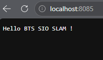
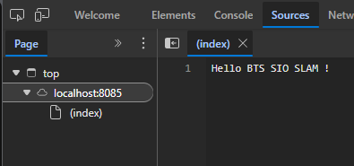
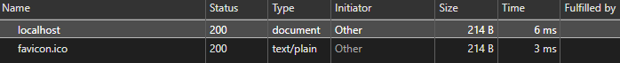
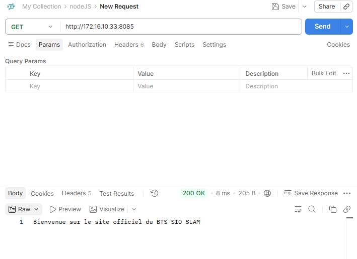

# Mission 1
## Travail à faire
### Que remarquez vous ?

### Sauriez-vous identifier le contenu qui s'affiche dans la page web dans les sources du serveur app.js ?

### Rechargez la page web ! Le contenu est mis à jour. Pourquoi?
> non, le contenu n'est pas mis à jour car il faut relancer le serveur node.js

### A quoi correspond le numéro 200 dans le code?

> ça signifie que tout c'est bien passer

### Ouvrez le panneau de développeur sur votre navigateur. Allez dans l'onglet Network. Rechargez la page. Que voyez vous?

### Accéder au serveur avec un outil de test d'API

---

# Mission 2

### Sauvegardez le changement puis rechargez la page web, que remarquez vous ?
PS D:\10.-REPO-ALL-TP\B2\nodeJS> node --watch app.js
Serveur démarré sur le port 8085
Page: /
(node:18288) [DEP0169] DeprecationWarning: `url.parse()` behavior is not standardized and prone to errors that have security implications. Use the WHATWG URL API instead. CVEs are not issued for `url.parse()` vulnerabilities.
(Use `node --trace-deprecation ...` to show where the warning was created)
Page: /favicon.ico
Page: /.well-known/appspecific/com.chrome.devtools.json

### Ajoutez un paramètre de requête dans l'url (e.g. http://IP-DU-SERVEUR:8085?test=btssioslam); que remarquez vous ?
PS D:\10.-REPO-ALL-TP\B2\nodeJS> node --watch app.js
Serveur démarré sur le port 8085
Page: /:8085
(node:16900) [DEP0169] DeprecationWarning: `url.parse()` behavior is not standardized and prone to errors that have security implications. Use the WHATWG URL API instead. CVEs are not issued for `url.parse()` vulnerabilities.
(Use `node --trace-deprecation ...` to show where the warning was created)
Page: /.well-known/appspecific/com.chrome.devtools.json
Page: /favicon.ico

### Connaissez vous d'autres méthodes d'affichage dans la console que console.log()?
console.table()
console.error()
console.dir()

---

# Mission 3
