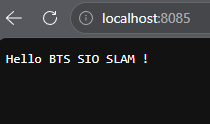
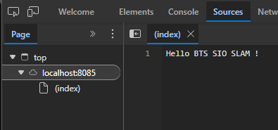
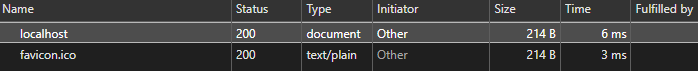
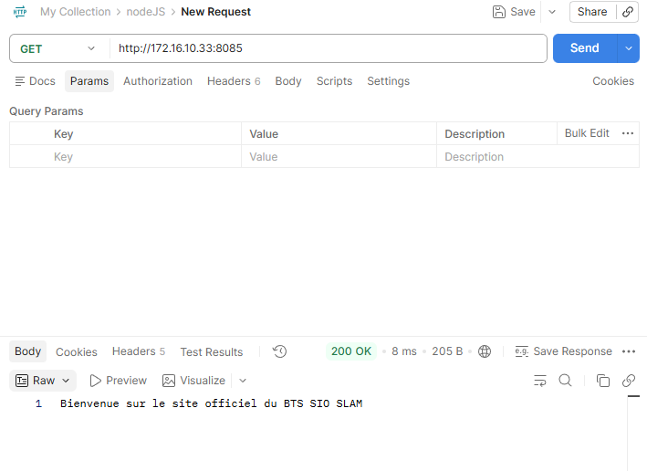

# Mission 1
## Travail à faire
### Que remarquez vous ?

### Sauriez-vous identifier le contenu qui s'affiche dans la page web dans les sources du serveur app.js ?

### Rechargez la page web ! Le contenu est mis à jour. Pourquoi?
> non, le contenu n'est pas mis à jour car il faut relancer le serveur node.js

### A quoi correspond le numéro 200 dans le code?

> ça signifie que tout c'est bien passer

### Ouvrez le panneau de développeur sur votre navigateur. Allez dans l'onglet Network. Rechargez la page. Que voyez vous?

### Accéder au serveur avec un outil de test d'API

---

# Mission 2

### Sauvegardez le changement puis rechargez la page web, que remarquez vous ?
PS D:\10.-REPO-ALL-TP\B2\nodeJS> node --watch app.js
Serveur démarré sur le port 8085
Page: /
(node:18288) [DEP0169] DeprecationWarning: `url.parse()` behavior is not standardized and prone to errors that have security implications. Use the WHATWG URL API instead. CVEs are not issued for `url.parse()` vulnerabilities.
(Use `node --trace-deprecation ...` to show where the warning was created)
Page: /favicon.ico
Page: /.well-known/appspecific/com.chrome.devtools.json

### Ajoutez un paramètre de requête dans l'url (e.g. http://IP-DU-SERVEUR:8085?test=btssioslam); que remarquez vous ?
PS D:\10.-REPO-ALL-TP\B2\nodeJS> node --watch app.js
Serveur démarré sur le port 8085
Page: /:8085
(node:16900) [DEP0169] DeprecationWarning: `url.parse()` behavior is not standardized and prone to errors that have security implications. Use the WHATWG URL API instead. CVEs are not issued for `url.parse()` vulnerabilities.
(Use `node --trace-deprecation ...` to show where the warning was created)
Page: /.well-known/appspecific/com.chrome.devtools.json
Page: /favicon.ico

### Connaissez vous d'autres méthodes d'affichage dans la console que console.log()?
console.table()
console.error()
console.dir()

---

# Mission 6

requete API sécurisé par 

- api-key

- bearer-token

- basic-auth

{
  "info": {
    "_postman_id": "20920fee-9a88-4270-af83-95e9a77908d6",
    "name": "My Collection",
    "description": "### Welcome to Postman! This is your first collection.\n\nCollections are your starting point for building and testing APIs. You can use this one to:\n\n• Group related requests  \n• Test your API in real-world scenarios  \n• Document and share your requests\n\nUpdate the name and overview whenever you’re ready to make it yours.\n\n[Learn more about Postman Collections.](https://learning.postman.com/docs/collections/collections-overview/)",
    "schema": "https://schema.getpostman.com/json/collection/v2.1.0/collection.json",
    "_exporter_id": "51850210"
  },
  "item": [
    {
      "name": "nodeJS",
      "item": [
        {
          "name": "en basic",
          "request": {
            "auth": {
              "type": "basic",
              "basic": [
                {
                  "key": "username",
                  "value": "test",
                  "type": "string"
                },
                {
                  "key": "password",
                  "value": "test",
                  "type": "string"
                }
              ]
            },
            "method": "GET",
            "header": [],
            "url": {
              "raw": "http://172.16.10.33:8085/basic-auth",
              "protocol": "http",
              "host": [
                "172",
                "16",
                "10",
                "33"
              ],
              "port": "8085",
              "path": [
                "basic-auth"
              ]
            }
          },
          "response": []
        },
        {
          "name": "en api key",
          "request": {
            "auth": {
              "type": "apikey",
              "apikey": [
                {
                  "key": "key",
                  "value": "api-key",
                  "type": "string"
                },
                {
                  "key": "value",
                  "value": "test",
                  "type": "string"
                }
              ]
            },
            "method": "GET",
            "header": [],
            "url": {
              "raw": "http://172.16.10.33:8085/api-key",
              "protocol": "http",
              "host": [
                "172",
                "16",
                "10",
                "33"
              ],
              "port": "8085",
              "path": [
                "api-key"
              ]
            }
          },
          "response": []
        },
        {
          "name": "en bearer",
          "request": {
            "auth": {
              "type": "bearer",
              "bearer": [
                {
                  "key": "token",
                  "value": "test",
                  "type": "string"
                }
              ]
            },
            "method": "GET",
            "header": [],
            "url": {
              "raw": "http://172.16.10.33:8085/bearer-token",
              "protocol": "http",
              "host": [
                "172",
                "16",
                "10",
                "33"
              ],
              "port": "8085",
              "path": [
                "bearer-token"
              ]
            }
          },
          "response": []
        }
      ]
    }
  ]
}