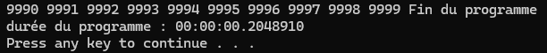

## Répondez aux questions suivantes:
### Que fait le programme dans cet état? 
il écrit la durée du programme et il attend qu'on clique sur une touche

### Quelle est la durée de ce programme en secondes ?
00:00:00.0125495

### En millisecondes (ms) ?
00.0125495

### Résultat (fournissez une impression ecran)

### Quelle est la durée du programme en secondes ?
00:00:00.2048910

### Relancez le programme. Quelle est sa durée ?
00:02:37.1984266
Mettez maintenant une temporisation de 1 seconde (= 1 000 ms).
Lancez le programme : quel est l’effet sur l’attaquant ?
